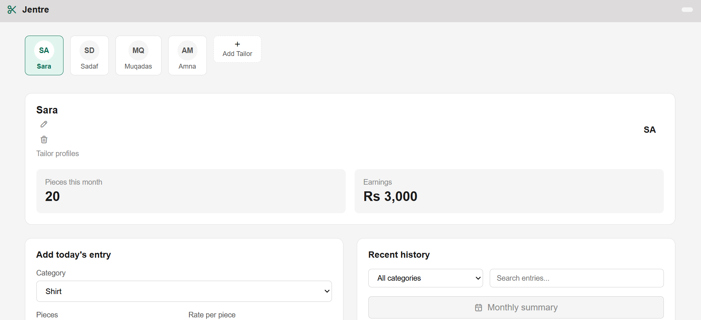

# Jentre Tailoring Dashboard

A simple dashboard I built to help track daily work for the tailors at my family's shop, Jentre. This is my first project built from scratch using HTML, CSS, and JavaScript.



## Why I built this

My mom handles the tailoring side of Jentre, our online boutique. A few tailors work with her, and every day they'd come and tell her what they stitched shirts, trousers, pajamas, whatever it was — and she'd write it all down on a register by hand.

I was learning JavaScript around this time and looking for a small real project to practice on. One day I was watching her write it all down in the register, and it clicked  this was something I could actually build. It could've just as easily been done in Excel or Google Sheets, but I wanted the practice of building it myself, so I decided to make this instead.

## What it does

- Add multiple tailor profiles, and switch between them to see their individual work history
- Add a daily entry for a tailor: category (shirt/trouser/pajama), number of pieces, and rate per piece
- Automatically calculates earnings for each entry
- See a summary of total pieces and earnings for the selected tailor
- Edit or delete an entry if a mistake was made
- Undo a deleted entry (5 second window before it's gone for good)
- Search and filter the history list by category or keyword
- See a monthly summary of pieces and earnings for a tailor
- Rename or remove a tailor
- Add a new tailor anytime
- All data is saved in the browser using localStorage, so it's still there after a refresh

## Tech stack 

- HTML
- CSS
- JavaScript (no frameworks, no libraries  just vanilla JS)
- localStorage for saving data (no backend/database yet)

I kept this simple on purpose. This is my first project and I'm still learning JavaScript, so I didn't want to jump into React or a backend before I was solid on the basics.

## How to run it

No installation needed. Just download the files and open `index.html` in your browser.

```
jentre-tailoring/
├── index.html
├── style.css
├── script.js
├── screenshot.png
├── LICENSE
└── .gitignore
```

The dashboard comes with some sample data (a few tailors and entries) already filled in, so you can see how it works right away. If you want to start fresh, just clear your browser's localStorage for this page.

## What I struggled with (and learned)

This was my first time really working with JavaScript, so a lot of this project was trial and error:

Ran into a lot of bugs early on just from typos mixing up uppercase and lowercase in class names between my HTML and CSS (like Tailor-chip vs tailor-chip). Cost me a lot of debugging time until I made it a habit to keep everything lowercase and consistent.
The trickiest bug was with tailor IDs. I was generating new IDs based on the array length, but after deleting and adding tailors a few times, one specific tailor stopped working properly  clicking on it would show a different tailor's data instead. Took a while to figure out the IDs were colliding. Fixed it by generating IDs based on the highest existing ID instead of the array length.
Also learned how event delegation works, since buttons like edit and delete are created dynamically and don't exist yet when the page first loads.

## Next steps

- Calendar view to see work by specific date
- Category management (currently hardcoded to shirt/trouser/pajama)
- A proper backend instead of localStorage
- Rebuilding this with React once I learn it

## License

MIT see [LICENSE](./LICENSE) file.